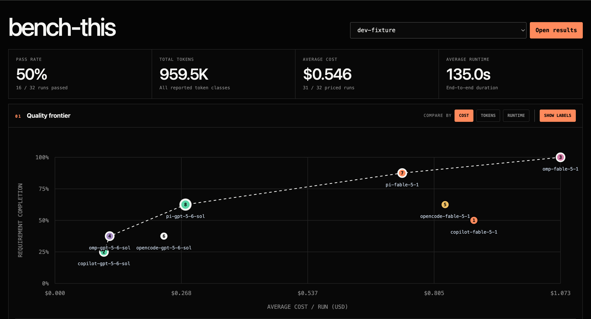

# Bench-this: Benchmark coding agents on your codebase



Turn real changes from your repository's history into behavior-focused tasks. Compare full setups —
model, reasoning settings, harness, skills, MCP servers, workspace instructions — on the same tasks
to see what works on your codebase.

Each run records completion, token usage, duration, and cost when available.

> Implementation details: [technical guide](docs/implementation-guide.html).

## Installation

```bash
npx skills add makefinks/bench-this
```

## Supported setups

`bench-this` supports these harness and provider combinations:

| Harness            | GitHub Copilot (`github-copilot`) | OpenAI Codex (`openai-codex`) | OpenCode Zen (`opencode`) | OpenCode Go (`opencode-go`) | Amazon Bedrock (`amazon-bedrock`) | OpenRouter (`openrouter`) |
| ------------------ | --------------------------------- | ----------------------------- | ------------------------- | --------------------------- | --------------------------------- | ------------------------- |
| Native Copilot CLI | ✓                                 |                               |                           |                             | ✓                                 | ✓                         |
| OpenCode           | ✓                                 | ✓                             | ✓                         | ✓                           | ✓                                 | ✓                         |
| Oh My Pi           | ✓                                 | ✓                             |                           |                             | ✓                                 | ✓                         |
| Pi                 | ✓                                 | ✓                             |                           |                             | ✓                                 | ✓                         |

See [configuration.md](skills/bench-this/references/configuration.md) for setup commands and
reproducibility rules. Contributions that add another harness or provider are greatly appreciated.

## The idea in one minute

Suppose a project added duplicate-email detection six months ago. That change gives us two useful
points in history:

```text
base commit                         reference commit
feature does not exist              feature works
       │                                  │
       └── find: probe behavior at both ──┘
           ends, shortlist candidates,
           and stop for your approval
                          │
                          ▼
     approve: you choose which candidates become
     tasks; one coordinator agent runs the rest
                          │
                          ▼
     prepare: the coordinator builds a separate scratch
     workspace for each approved task
                          │
                          ▼
     task agents × N work in parallel; each authors a
     prompt plus public and hidden test suites, organized
     into independently evaluated requirement groups
                          │
                          ▼
     verifier agents × N work in parallel; each checks
     one bundle without editing it
                          │
                          ▼
     review: the coordinator reads every bundle,
     fixes what it can, and accepts each task once
                          │
                          ▼
     build: the coordinator combines shared setup needs
     and proves the benchmark's Docker image builds
                          │
                          ▼
     validate: each task's public and hidden tests run
     against both commits; both suites must fail on the
     base for the requested behavior and pass on reference
                          │
                          ▼
     configure: define benchmark treatments or tell the agent
     which setups you want to test and compare
                          │
                          ▼
     run: evaluate each configured task/treatment pair in
     an isolated container. The solver receives the public
     prompt, public tests, and a writable base-commit workspace.
     Git history, authenticated host CLIs, and hidden tests
     remain inaccessible
                          │
                          ▼
     compare: inspect results by configuration and task,
     including pass rate, token usage, cost, runtime,
     and failure reasons

```

The reference commit calibrates the evaluator; solver agents never see its patch.

That gives the experiment a useful question:

> Starting from the same historical state, which agent configurations can recreate the requested
> behavior?

## A typical journey

You need Git history, a running Docker daemon, and the skill installed. Measured runs also
need a subscription (or other forms of authentication) for the chosen harness and provider.

1. **Find candidates.** From the repo you want to benchmark, ask:
   `Use the bench-this skill to find 3 benchmark task candidates.` Defaults to showing you 5
   candidates when you omit the count.
2. **Approve tasks.** Pick which candidates from the git history become tasks. The agent scaffolds
   `benchmarks/`,
   authors prompts plus public and hidden tests, and proves each task fails on the base commit
   and passes on the reference commit.
3. **Choose what to compare.** Tell the agent which harnesses, models, skills, or MCP servers to
   compare. It configures one treatment per setup.
4. **Authenticate once.** Run the `auth login` or provider `auth set-key` command the agent gives
   you, then ask it to run. It checks Docker, the image, and profiles, and evaluates each
   task/treatment pair in an isolated container.
5. **Compare results.** Results land under `benchmarks/results/` with pass rate, tokens, cost,
   runtime, and failure reasons per configuration and task. Open `benchmarks/viewer.html` for the
   interactive comparison.

## Developing

`src/agent_bench/` is canonical; `skills/bench-this/assets/benchmarks/_vendor/` is generated.

```bash
PYTHONPATH=src:. uv run --extra test pytest
python3 scripts/format_markdown.py --check
python3 scripts/sync_vendored_runner.py --check
```
